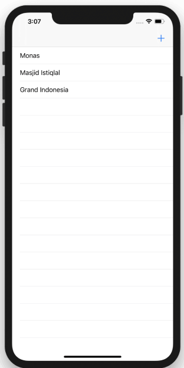
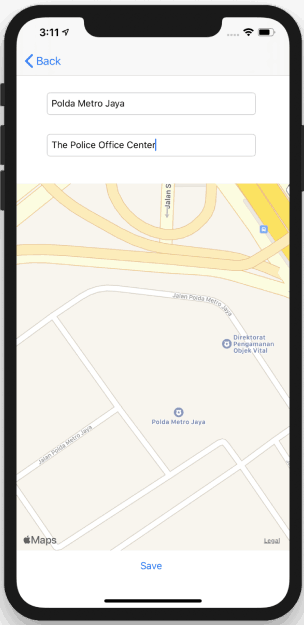
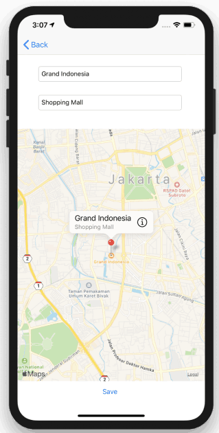

# Art Book Project
🚗Travel book is ios app for create map location and show again. And data will be save into local database

# How To Use 

1. Click plus button to add location. Fill name and description in the form.
2. Select location based on you input location before. Hold on map location while 3 seconds and then pin will be show up. Then click save button.
3. Location name will be show in table view.
4. To view detail map, select one of location name in list.
5. Detail location and map pin will be show in detail screen.

# Screnshoot

* **Faridho** - [Medium](https://medium.com/@faridho)
